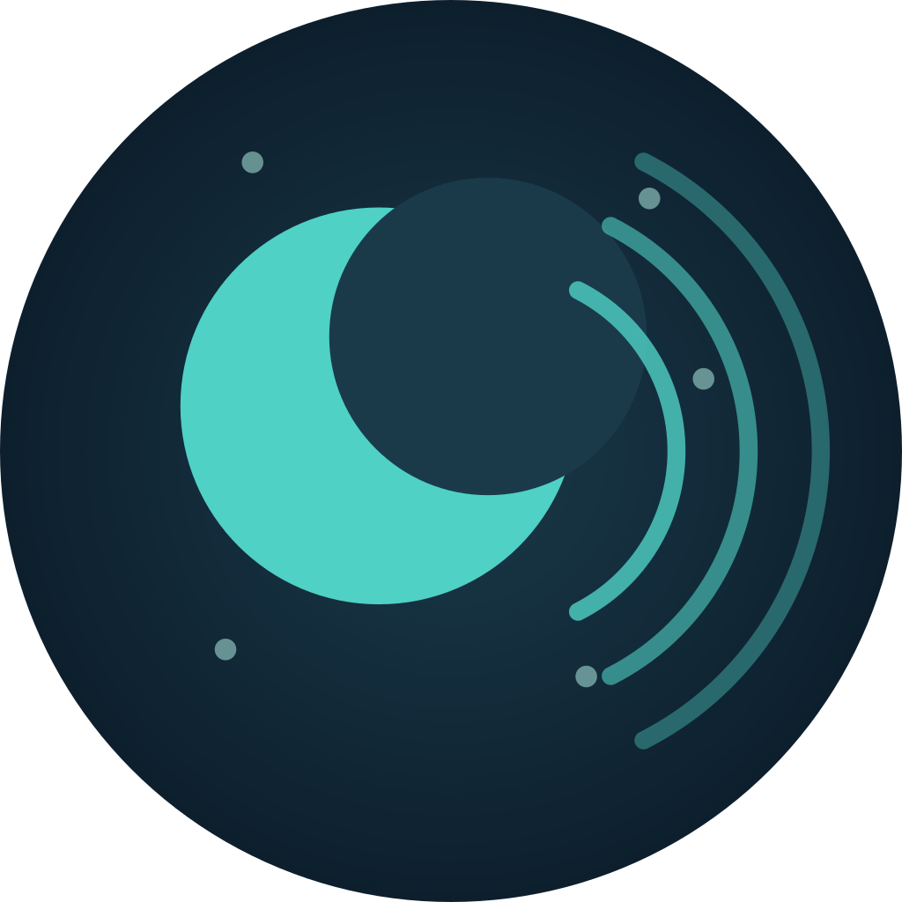

<div align="center">



# Slumbr

**Smart sleep-aid app that plays ambient sounds and auto-fades volume as you fall asleep**

[](https://github.com/SnowWarri0r/slumbr/stargazers)
[](LICENSE)
[](https://github.com/SnowWarri0r/slumbr/releases)
[](https://flutter.dev/)
[](https://dart.dev/)
[]()

Pick a sound, press play, fall asleep — Slumbr detects your sleep and gently fades the volume to silence.
No timers to set, no manual adjustments. Just sleep.

</div>

---

## Features

- **19 Curated Sounds** — Hand-picked ambient sounds across 4 categories
- **Sleep Detection** — Microphone-based monitoring detects when you fall asleep
- **Smooth Volume Fade** — Continuous linear interpolation, not jarring step changes
- **Live Switching** — Change sounds mid-session without restarting detection
- **Sleep Summary** — Duration, stage breakdown, and timeline when you stop
- **Categorized Browser** — Expandable categories: Rain, Nature, Noise, Other
- **Zero Config** — No account, no cloud, no timers to set — just press play

## How It Works

```
┌─────────────┐   Microphone    ┌─────────────┐   Volume    ┌─────────────┐
│  Calibrate  │───────────────►│   Detect    │────────────►│    Fade     │
│  (10 sec)   │   Amplitude    │ Sleep Stage │   Factor    │   Volume   │
└─────────────┘   Monitoring   └─────────────┘  (smooth)   └─────────────┘
```

1. Pick a sound from 4 categories and tap **Start**
2. App calibrates baseline noise level for ~10 seconds
3. Microphone monitors ambient noise every 500ms
4. As your environment gets quieter, sleep stages progress:

| Quiet Duration | Stage | Volume | Behavior |
|:-:|:-:|:-:|:-:|
| 0 – 3 min | Awake | 100% | Full volume |
| 3 – 8 min | Falling Asleep | 100% → 60% | Gradual fade |
| 8 – 15 min | Light Sleep | 60% → 30% | Continues fading |
| 15 – 20 min | Deep Sleep | 30% → 0% | Fades to silence, stops |

5. If noise is detected, volume smoothly ramps back up
6. On stop, a **Sleep Summary** dialog shows your session history

## Sound Library

| Category | Sounds |
|----------|--------|
| 🌧 Rain | Heavy Rain, Light Rain, Rain on Window, Rain on Tent, Thunder |
| 🌿 Nature | Campfire, River, Waterfall, Waves, Wind in Trees, Jungle, Crickets |
| 🔊 Noise | Brown Noise, Pink Noise, White Noise |
| ✨ Other | Cat Purring, Singing Bowl, Inside a Train, Underwater |

## Getting Started

### Prerequisites

- [Flutter SDK](https://docs.flutter.dev/get-started/install) >= 3.11
- Android SDK (compileSdk 36) or Xcode for iOS
- Java 17

### Install & Run

```bash
# Clone
git clone https://github.com/SnowWarri0r/slumbr.git
cd slumbr

# Install dependencies
flutter pub get

# Run on connected device
flutter run
```

### Build

```bash
# Android APK
flutter build apk --release

# iOS (requires macOS + Xcode)
flutter build ios --release
```

## Tech Stack

| Layer | Technology |
|-------|------------|
| Framework | Flutter + Material Design |
| Audio | just_audio (looping, volume control) |
| Recording | record (amplitude monitoring) |
| Permissions | permission_handler |
| Storage | path_provider |

## Architecture

```
lib/
  main.dart            # App entry, MaterialApp config
  home_page.dart       # Main UI — sound picker, playback, sleep status, summary dialog
  sleep_detector.dart  # Microphone monitoring, stage detection, sleep recording

assets/audio/
  rain/                # 5 rain & storm sounds
  nature/              # 7 nature & wildlife sounds
  noise/               # 3 colored noise variants
  other/               # 4 unique ambient sounds
```

## CI/CD

| Workflow | Trigger | Action |
|----------|---------|--------|
| CI | Push / PR to `main` | `flutter analyze` |
| Release | Push `v*` tag | Build APK → GitHub Release |

```bash
# Create a release
git tag v1.0.0
git push origin v1.0.0
# → GitHub Actions builds APK and publishes release automatically
```

## Sound Credits

Ambient sounds sourced from [Moodist](https://github.com/remvze/moodist) (MIT License).

## Contributing

Issues and PRs are welcome! Feel free to open an [issue](https://github.com/SnowWarri0r/slumbr/issues) for bug reports or feature requests.

## License

[MIT](LICENSE) &copy; [SnowWarri0r](https://github.com/SnowWarri0r)

---

<div align="center">

If this project helps you sleep better, consider giving it a :star:

</div>
